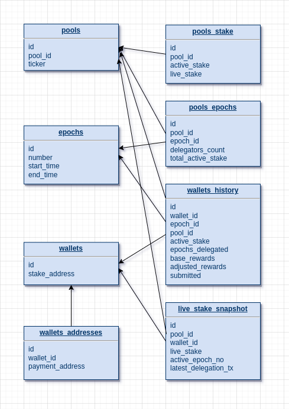

# ispo-calculator
An app that lets Orcfax ISPO delegators calculate their rewards

## The backend
### config.py
This is the configuration file. The following variables must be defined:
- POOL_IDS_BECH32: stake pool ID(s) (as a list with one or more stake pool IDs in bech32 format).
- START_EPOCH: the epoch when the ISPO starts.
- END_EPOCH: the epoch when the ISPO ends. It can be set to a value in the future and changed later.
- REWARDS_RATE: the amount of tokens won as rewards per epoch for each ADA staked.
- FILES_PATH: the path where the files will be saved. It can be set also as an environment variable.
- LOGS_PATH: the path where the log file(s) will be saved. It can be set also as an environment variable.
- DB_PATH: the path where the database will be saved. It can be set also as an environment variable.
- SNAPSHOT_LOG_FILE: the snapshot log file
- DB_NAME: the sqlite3 database file

### library.py
This file has a few functions used by the main script. It also creates the required folders and sets up logging.
The database structure:

### snapshot.py
This is the main script which must be executed to do the stake snapshot for each epoch and to calculate the rewards.
It can be executed once each epoch, but it can also be executed for multiple epochs from the past.
The script also calculates if the snapshots for the previous epochs are correct, and if not, it will do the snapshot 
again for them. At the end, the ISPO data will be written in a JSON file and in an Excel file, and the snapshots 
will be validated one more time, comparing the total active stake of the pools for each epoch with the sum of the 
active stake of all delegators for each epoch.
The script is using the Koios API via the [koios_api](https://github.com/cardano-apexpool/koios-api-python) 
Python wrapper.
